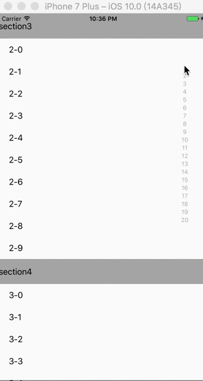

# TableViewIndicator

## 说明

原生的TableView指示器没有特效，在手指滑动的时候会被遮挡，为此自造一个指示器，更加符合用户体验，效果如下：



## 安装方法

手动安装，将Classes中的文件拖入工程即可

## 使用方法


```
// 先引用指示器view
#import "IndicatorView.h"

// 声明指示器对象
    IndicatorView * idc = [[IndicatorView alloc] init];

// 添加到视图中
    [self.view addSubview:idc];

// 设置指示器的文字
    idc.titles = titleArr;

// 设置指示器的位置，仅x,y能设置，宽高会自动根据内容调整
    idc.frame = CGRectMake(self.view.bounds.size.width - 50, 100, 0, 0);
    
// 设置指示器指示的tableView
    idc.tableView = tableView;

```

